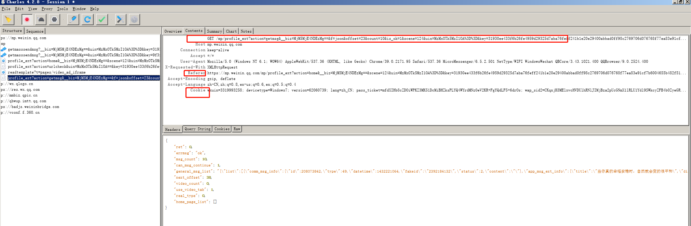
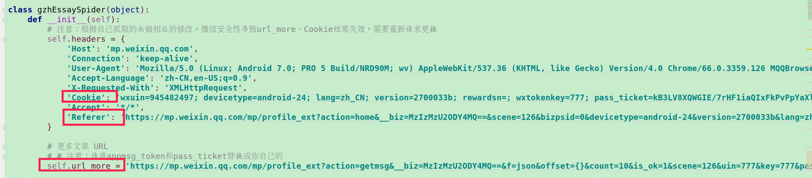
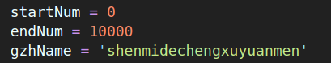
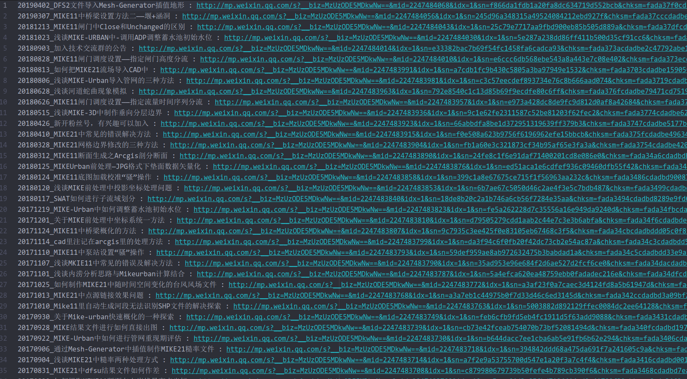
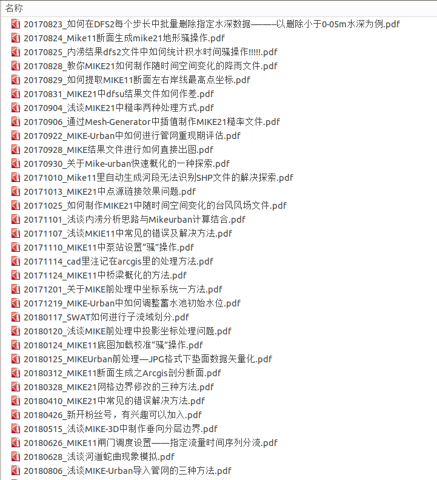
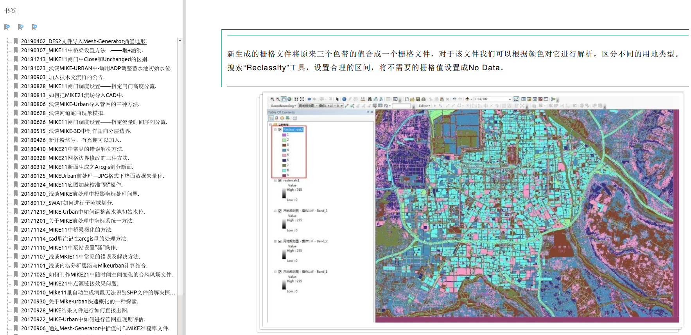
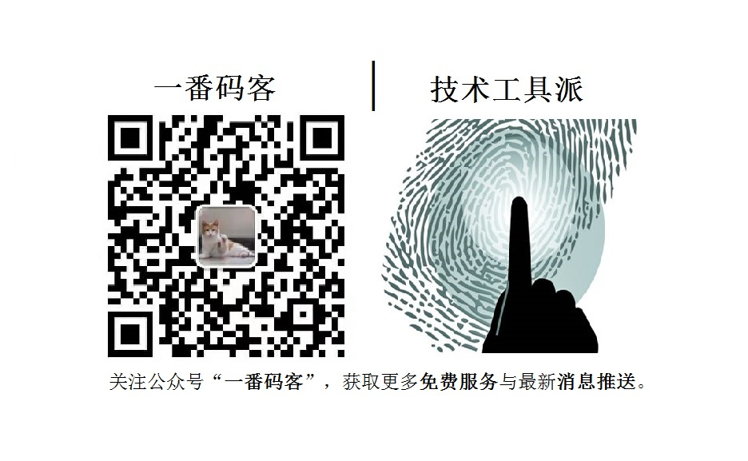

# 一番 "公众号文章下载" 开源项目与免费下载服务

## 项目缘起
* **技术工具**：现在微信公众号有很多高质量的文章输出，是我们学习的好地方，但手机看太零散，又不方便查找，从而想到将微信公众号的文章导出为PDF可以方便查阅学习。  
* **学习**：通过一个实际、实用、有意思的项目来帮助想入门python的同学学习python。  

## 项目发展：
作为一个开源项目，急切希望感兴趣（对代码有洁癖有强迫症）的朋友加入，注入活泼血液，一起交流学习，共同参与，长期维护，升级优化。
> 希望加入的朋友文章尾部加一番微信，发送github用户名，一番将你加入到contributor。

## 调研与尝试
前期尝试用adb模拟人工操作去一篇一篇获取文章链接并保存到本地，然后通过webdriver打开链接模拟人工按键去用浏览器打印为pdf。  
这其中还用到了图文识别获取文章标题，中间APP获取并传输链接到PC。虽然最后得到的pdf因为浏览器渲染原因效果很好，但效率很低，爬去一篇文章差不多一分钟，这怎么能忍。  
后来通过不断学习尝试，得到了用Charles抓包获取文章信息，wkhtmltopdf将网页转换为pdf，虽然wkhtmltopdf有图片无法加载和失真的问题，但都一一解决了。  

## 实现原理
1.　通过手机抓包获取微信公众号历史文章的  “ 日期_标题：链接 ” 。  
2.　通过wkhtmltopdf将网页转换为pdf。  

##  软件操作指南
> 感谢 @WenyinWei 同学的补充。

> 准备工作：
1.　需要一部手机，安装微信，
2.　需要一部电脑，目前仅支持 ubuntu，安装抓包工具 Charles；

1.　从 Git 上面 Clone 本库，在 tools 文件夹中有 wkhtmltopdf 安装包，双击安装。

2.　让手机和电脑连上同一个 Wifi ，手机上 Wifi 的高级设置将自己的电脑设置为代理服务器里面：
   - 主机名设置为自己电脑的IP地址
   - 端口设置为8888。

3.　打开 Charles, 注意这个时候如果连接正常，Chalres 会提示有设备连接。如果没有，说明可能没有配置正确，需要查询网络上其他的指导文章，了解如何用 Charles 作为手机发信的过滤器。这一步骤比较专业，可参考：
   - https://juejin.im/post/5a420adff265da432c241adc
   - https://www.jianshu.com/p/831c0114179f
   - https://www.jianshu.com/p/beaa56846f50
   - https://blog.csdn.net/manypeng/article/details/79475870

4.　如果 Charles 显示连接成功了，这时候在手机上浏览任意页面应该都会有新的数据流被 Charles 截留，显示在 Charles 内。

5.　手机打开到要爬取的公众号的历史文章页，往下滑，注意在电脑上这时会出现对应的链接的信息择。下图中有三个方框，里面的链接之后在扒的时候需要用。  
  
第一个方框中的内容右键点 copy URL,其他两个右键点 copy selection。第一个框中的内容里面有个 offset 字段，这就代表那是你往下划的时候的请求，你要把 offset 等号后面的数字用 {} 替换。这就是我们需要抓取的历史页面下往下滑的时候加载更多数据的那个包。

6.　打开 android_wechat 文件夹下的 python 文件，需要修改三个部分。其中的 Cookie 和 Referer 直接用上一步中复制的内容就好。下面的那一框则对应上一步中 copu URL得到的东西，直接将内容粘贴上去即可，覆盖掉原本的文本。

7.　在主 python 程序中，即 auto_opt_main.py,修改如下这三个参数，他们代表程序扒的文章起止序号和存放的文件夹名字。

>记得在主文件夹下新建一个 out 文件夹存放pdf ，否则程序会报错。

8.　运行 auto_opt_main.py 即可，pdf 文件都存到了 /auto_pot-master/out/{gzhName}/ 的文件夹下。
> 如果提示需要安装相关python依赖包，请自行安装。

## 成果展示

## 免费下载服务
- 看到这里，如果你还觉得操作太复杂，就想简简单单舒舒服服的下几篇文章，然后专心学习，乐于结交朋友的一番可以免费为你下载一个公众号的最新50篇文章。  
> 关注公众号“一番码客”，添加一番微信（备注“公众号下载”），发送公众号名片即可。  
- 花费大量时间的源码和操作手册和免费服务都有了，如果50篇还不能满足你，一番要收费了，5元/100篇下载后面的其他文章。  

## 待开发功能:
* windows 运行兼容  
* 本地web启动程序操作界面  
* 每篇文章评论采集，并附到pdf文章中  
* 变量项自动导入  

## 交流沟通
### 公众号
一番不定期更新原创技术文章，实用软件小工具，工作学习心得，生活随笔，还提供一些免费服务。  
如果满意，文章点个赞评论鼓励下一番吧，让一番有动力坚持下去这样子，谢谢啦！  

### 微信
如果有什么意见建议或者任何想交流的，请公众号文章留言或加一番微信告诉一番。  
**交流产生价值，朋友多来路好走。**

> **世间很美好，时间是上天给予的最珍贵的礼物！技术人不应该只有眼前的996，还有要陪伴的人和要努力的事。**  
截止目前，一番业余时间已经帮近百位同学提供免费下载服务了。非常高兴开发的小工具能帮助到大家。  
但时间和精力有限，一番个人微信通常在线时间段（12:00-13:00; 19:00-22:00），其他时间段不定时回复。  
